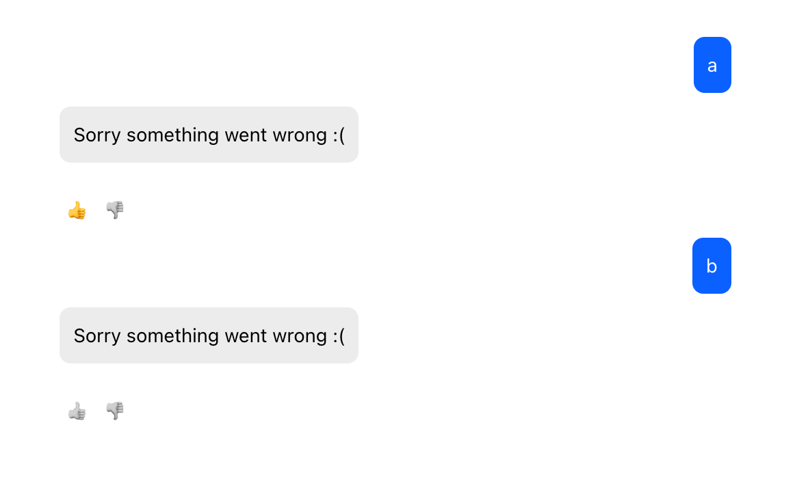

# Makeup tasks

These tasks should be completed if you failed to address the tasks in the ["zh"](https://github.com/szalontaijordan/nye-2025-zh/tree/main)

## HTML / CSS

There was a change already made in `src/ChatContainer.js` for the "active" logic for like/dislike buttons in [cab621a368954577e4d4bd4e67b38d4ca5b3b51c](https://github.com/szalontaijordan/nye-2025-zh-2/commit/cab621a368954577e4d4bd4e67b38d4ca5b3b51c).

Using **CSS ONLY** make the component look like as on the screenshot:

```
DO NOT CHANGE THE JSX CODE.
```




The CSS can be added into the CSS of the component e.g. `src/ChatContainer.css`

HINT: emojis count as regular unicode characters, even in CSS

HINT: when clicking a button an `active` class is added to them. The "not active" buttons are grayscale, the "active" was are with color. See JSX code for details.

Before you begin, make sure the project is properly set up.

```
cd <location you cloned the repository to>
npm install
```
To run the app locally:
```
npm start
```

To see a response simply send a message to the chat (e.g. "a"). Don't worry about starting the backend.

## JS

There is **1** function to implement. If all unit tests pass, you can consider the implementation successful. Feel free to use any built-ins, documentation, help, etc. for your solution.

You can find this in:

`src/utils/calculate-chat-cost.js`

The details are written in the form of jsdoc comments e.g.
```
/*
      TODO: implement function below based on the jsdoc.
*/
 ```
Before you begin, make sure the project is properly set up.

```
cd <location you cloned the repository to>
npm install
```
To run tests:
```
npm run test
```

## Submitting your solution
Make sure both tasks are completed. If you feel so, open a PR to the main branch from your dedicated branch e.g. `main <-- zh/jordan-szalontai`

